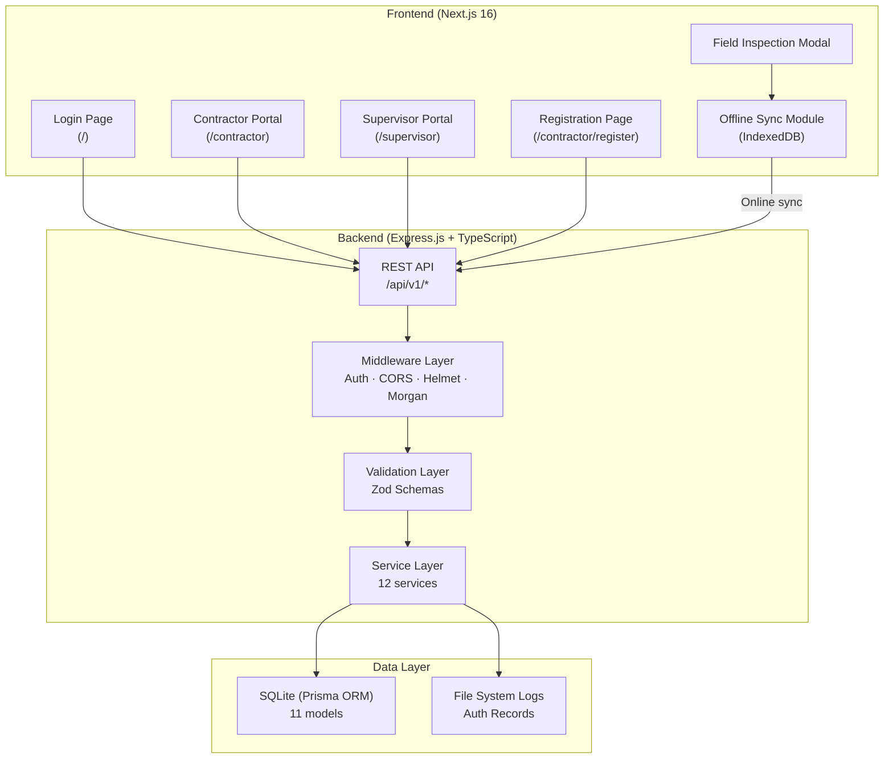
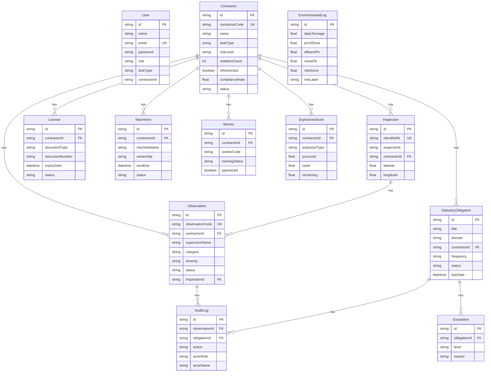

# MineSight — Comprehensive Project Analysis

> **AI-Based Smart Governance & Compliance Monitoring System for Coal Mines**
> Smart India Hackathon 2026 — Software Track

---

## 1. Project Overview

MineSight is a **full-stack web application** designed to digitize and streamline governance, safety compliance, and environmental monitoring in Indian coal mining operations. It replaces the fragmented paper/spreadsheet layer used across mine sites with a unified digital platform that tracks issues end-to-end — from observation to resolution.

### Problem Statement
Indian coal mining involves multiple stakeholders (mine management, contractors, inspectors) whose governance data — statutory compliance, safety observations, license tracking, worker attendance, environmental readings — is scattered across paper registers, spreadsheets, and emails. This causes:
1. **Data inconsistency** across multiple sources
2. **Delayed decision-making** by days
3. **Limited transparency** for management
4. **Compliance gaps** — expired licenses/overdue inspections going unnoticed
5. **Weak field monitoring** — verbal warnings never formally tracked

### Solution
MineSight implements a **2-role MVP** (Contractor + Supervisor) that provides:
- **Closed-loop governance**: Issue → Red Flag → Contractor Evidence → Supervisor Verification → Permanent Audit Trail
- **Contractor-type adaptability** via a `taskType` field (blasting / transportation / excavation / maintenance)
- **Unified license, machinery, and observation tracking** in one platform
- **Deterministic, rule-based risk scoring** — no black-box AI

---

## 2. System Architecture



### Architecture Pattern
- **Monorepo** structure with `frontend/` and `backend/` directories
- **Service-oriented backend** — Controller → Service → Prisma ORM
- **RESTful API** design with versioned routes (`/api/v1`)
- **Offline-first** field inspection capability using IndexedDB
- **Client-side routing** via Next.js App Router

---

## 3. Technical Frameworks & Libraries — Detailed Breakdown

### 3.1 Backend Stack

| Technology | Version | Purpose & Usage |
|---|---|---|
| **Node.js** | Runtime | JavaScript runtime for the server-side application |
| **TypeScript** | ^5.7.3 | Statically typed superset of JavaScript. Used throughout the backend for type safety in controllers, services, validators, and middleware. Compiles via `tsc` to `dist/` |
| **Express.js** | ^4.21.2 | Core HTTP framework. Handles all API routing, middleware chaining, and request/response lifecycle. Configured with JSON body parsing (50MB limit), URL encoding, and static file serving |
| **Prisma ORM** | ^6.4.1 | Type-safe database access layer. Manages all database operations including CRUD, transactions (`$transaction`), relations, cascading deletes, and schema migrations. Schema defined in [`schema.prisma`](file:///Users/aryanw/.gemini/antigravity-ide/scratch/MineSight/backend/prisma/schema.prisma) |
| **SQLite** | via Prisma | Lightweight relational database. Chosen for zero-config deployment in hackathon context. Stores all application data in [`dev.db`](file:///Users/aryanw/.gemini/antigravity-ide/scratch/MineSight/backend/prisma/dev.db) |
| **JSON Web Tokens (jsonwebtoken)** | ^9.0.3 | Authentication mechanism. Signs JWT tokens with a secret key, 7-day expiry. Tokens contain `{id, email, role, contractorId}`. Used in [`auth.service.ts`](file:///Users/aryanw/.gemini/antigravity-ide/scratch/MineSight/backend/src/services/auth.service.ts) |
| **bcryptjs** | ^3.0.3 | Password hashing library. Hashes user passwords with 10 salt rounds on registration, compares on login. Used in [`auth.service.ts`](file:///Users/aryanw/.gemini/antigravity-ide/scratch/MineSight/backend/src/services/auth.service.ts#L58) |
| **Helmet** | ^8.0.0 | HTTP security headers middleware. Sets various headers (Content-Security-Policy, X-Content-Type-Options, etc.) to protect against common web vulnerabilities. Configured with `cross-origin` resource policy for API access |
| **CORS** | ^2.8.5 | Cross-Origin Resource Sharing middleware. Configured to allow frontend (localhost:3000) to call backend (localhost:5001). Supports GET, POST, PUT, PATCH, DELETE methods with Authorization and x-user-role headers |
| **Morgan** | ^1.10.0 | HTTP request logger middleware. Logs all incoming API requests in "dev" format during development. Disabled in test environment |
| **Zod** | ^3.24.2 | Runtime schema validation library. Validates request bodies across all endpoints — auth, contractors, observations, licenses, machinery, workers, explosives. Each entity has a dedicated validator file in `src/validators/` |
| **tsx** | ^4.19.3 | TypeScript execution engine for development. Used for hot-reload dev server (`tsx watch src/server.ts`), running seeds (`tsx prisma/seed.ts`), and test scripts. Replaces `ts-node` |
| **dotenv** | ^16.4.7 | Environment variable loader. Reads `.env` file containing PORT, DATABASE_URL, CORS_ORIGIN, JWT_SECRET, and NODE_ENV |

### 3.2 Frontend Stack

| Technology | Version | Purpose & Usage |
|---|---|---|
| **Next.js** | 16.3.4 | React meta-framework. Provides App Router, file-based routing (`/contractor`, `/supervisor`, `/contractor/register`), server-side rendering capabilities, and optimized builds. Used as the primary frontend framework |
| **React** | 19.2.8 | UI library. All pages and components are React client components (`"use client"`). Uses hooks extensively — `useState`, `useEffect`, `useRef` for state management, lifecycle, and DOM references |
| **TypeScript** | ^5 | Type safety in the frontend. TSX files with typed state, props, and API responses. Configured via [`tsconfig.json`](file:///Users/aryanw/.gemini/antigravity-ide/scratch/MineSight/frontend/tsconfig.json) |
| **Tailwind CSS** | ^4 | Utility-first CSS framework. Primary styling approach for all components. Configured with PostCSS via [`postcss.config.mjs`](file:///Users/aryanw/.gemini/antigravity-ide/scratch/MineSight/frontend/postcss.config.mjs). Custom theme tokens defined in [`globals.css`](file:///Users/aryanw/.gemini/antigravity-ide/scratch/MineSight/frontend/src/app/globals.css) |
| **shadcn/ui** | ^4.19.1 | Component library built on Radix UI primitives. Provides the design system foundation — buttons, cards, and other UI primitives via [`components.json`](file:///Users/aryanw/.gemini/antigravity-ide/scratch/MineSight/frontend/components.json) |
| **Framer Motion** | ^13.2.0 | Animation library for React. Powers page transitions, modal animations, hover effects, and micro-interactions across the application |
| **Lucide React** | ^1.38.0 | Icon library. Provides all icons used throughout the UI — dashboard icons, status indicators, navigation icons, action buttons (120+ icon imports across the app) |
| **@tabler/icons-react** | ^3.46.0 | Secondary icon library. Supplements Lucide for specialized icons not available in the primary set |
| **next-themes** | ^0.4.6 | Theme management for Next.js. Powers the dark/light mode toggle across the application via [`ThemeProvider.tsx`](file:///Users/aryanw/.gemini/antigravity-ide/scratch/MineSight/frontend/src/components/ThemeProvider.tsx) and [`ThemeToggle.tsx`](file:///Users/aryanw/.gemini/antigravity-ide/scratch/MineSight/frontend/src/components/ThemeToggle.tsx) |
| **class-variance-authority (CVA)** | ^0.7.1 | Variant-based component styling utility. Used for creating consistent component variants (e.g., button sizes, colors) in [`button.tsx`](file:///Users/aryanw/.gemini/antigravity-ide/scratch/MineSight/frontend/src/components/ui/button.tsx) |
| **clsx** | ^2.1.1 | Conditional className utility. Used throughout the codebase for conditionally applying Tailwind classes based on state |
| **tailwind-merge** | ^3.6.0 | Tailwind CSS class conflict resolver. Merges conflicting Tailwind utility classes intelligently in the [`utils.ts`](file:///Users/aryanw/.gemini/antigravity-ide/scratch/MineSight/frontend/src/lib/utils.ts) helper |
| **tw-animate-css** | ^1.4.0 | Tailwind animation plugin. Provides pre-built CSS animation utilities for transitions and micro-animations |
| **mini-svg-data-uri** | ^1.4.4 | SVG data URI optimizer. Used for inline SVG backgrounds in UI components like [`background-beams.tsx`](file:///Users/aryanw/.gemini/antigravity-ide/scratch/MineSight/frontend/src/components/ui/background-beams.tsx) |
| **@base-ui/react** | ^1.7.0 | Headless UI component primitives from the Base UI (MUI) team. Provides unstyled, accessible component foundations |
| **IndexedDB** (Browser API) | Native | Offline data persistence. The [`offlineSync.ts`](file:///Users/aryanw/.gemini/antigravity-ide/scratch/MineSight/frontend/src/lib/offlineSync.ts) module uses IndexedDB to queue field inspections when offline and sync them when connectivity returns |

### 3.3 Aceternity UI Components

The project includes several **Aceternity UI** components for premium visual effects:

| Component | File | Usage |
|---|---|---|
| Background Beams | [`background-beams.tsx`](file:///Users/aryanw/.gemini/antigravity-ide/scratch/MineSight/frontend/src/components/ui/background-beams.tsx) | Animated beam effects for page backgrounds |
| Bento Grid | [`bento-grid.tsx`](file:///Users/aryanw/.gemini/antigravity-ide/scratch/MineSight/frontend/src/components/ui/bento-grid.tsx) | Grid layout for dashboard cards |
| Hero Highlight | [`hero-highlight.tsx`](file:///Users/aryanw/.gemini/antigravity-ide/scratch/MineSight/frontend/src/components/ui/hero-highlight.tsx) | Highlight text effects for landing page |
| Hover Border Gradient | [`hover-border-gradient.tsx`](file:///Users/aryanw/.gemini/antigravity-ide/scratch/MineSight/frontend/src/components/ui/hover-border-gradient.tsx) | Animated gradient borders on hover |
| Text Reveal Card | [`text-reveal-card.tsx`](file:///Users/aryanw/.gemini/antigravity-ide/scratch/MineSight/frontend/src/components/ui/text-reveal-card.tsx) | Text reveal animations |
| Timeline | [`timeline.tsx`](file:///Users/aryanw/.gemini/antigravity-ide/scratch/MineSight/frontend/src/components/ui/timeline.tsx) | Timeline component for audit trails |
| Typewriter Effect | [`typewriter-effect.tsx`](file:///Users/aryanw/.gemini/antigravity-ide/scratch/MineSight/frontend/src/components/ui/typewriter-effect.tsx) | Typewriter text animation |

---

## 4. Database Schema — Detailed Analysis

The database consists of **11 interconnected models** defined in [`schema.prisma`](file:///Users/aryanw/.gemini/antigravity-ide/scratch/MineSight/backend/prisma/schema.prisma):



### Key Schema Design Decisions
- **UUID primary keys** across all models for secure, non-sequential IDs
- **Cascade deletes** on contractor → observations, licenses, machinery, workers, explosives
- **SetNull** on observation → inspection (preserves observations if inspection deleted)
- **Unique constraints** on `observationCode`, `contractorCode`, `clientRefId` for idempotency
- **Deterministic status enums** — every status field has a defined set of values

---

## 5. API Endpoints — Complete Reference

The backend exposes **11 route modules** mounted at `/api/v1`:

### 5.1 Authentication (`/api/v1/auth`)
| Method | Endpoint | Description |
|---|---|---|
| `POST` | `/register` | Register new user (Contractor/Supervisor). Auto-creates Contractor record if role is CONTRACTOR |
| `POST` | `/login` | Authenticate user, return JWT token. Logs login event to file |
| `POST` | `/logout` | Log logout event |
| `GET` | `/me` | Get authenticated user profile |
| `GET` | `/records` | Get all auth event records (from file log) |

### 5.2 Contractors (`/api/v1/contractors`)
| Method | Endpoint | Description |
|---|---|---|
| `GET` | `/` | List contractors with filters (search, taskType, riskLevel, status), pagination |
| `GET` | `/:idOrCode` | Get single contractor with licenses, machinery, workers, observations |
| `POST` | `/` | Create new contractor |
| `PUT` | `/:id` | Update contractor |
| `DELETE` | `/:id` | Delete contractor |

### 5.3 Observations (`/api/v1/observations`)
| Method | Endpoint | Description |
|---|---|---|
| `GET` | `/` | List observations with filters (contractorId, category, severity, status, zone) |
| `GET` | `/:id` | Get observation with full audit trail |
| `POST` | `/` | Supervisor creates new observation → red-flags contractor → audit log |
| `PATCH` | `/:id/evidence` | Contractor submits evidence of correction |
| `PATCH` | `/:id/verify` | Supervisor verifies evidence → resolves or rejects |
| `DELETE` | `/:id` | Delete observation |

### 5.4 Compliance (`/api/v1/compliance`)
| Method | Endpoint | Description |
|---|---|---|
| `GET` | `/report` | Full compliance summary stats (single source of truth) |
| `GET` | `/` | List obligations with filters (domain, status, taskType, contractorId) |
| `POST` | `/` | Create statutory obligation (SUPERVISOR only) |
| `PATCH` | `/:id/evidence` | Submit compliance evidence |
| `PATCH` | `/:id/verify` | Verify compliance (approve/reject) |
| `POST` | `/:id/escalate` | Escalate obligation to management |
| `GET` | `/:id/audit` | Get obligation audit trail |

### 5.5 Risk Intelligence (`/api/v1/risk`)
| Method | Endpoint | Description |
|---|---|---|
| `GET` | `/overview` | Mine-wide risk overview with contractor rankings, anomalies |
| `GET` | `/contractors` | All contractor risk scores |
| `GET` | `/contractors/:id` | Individual contractor risk analysis with explainable factors |

### 5.6 Other Routes
| Module | Base Path | Key Operations |
|---|---|---|
| **Metrics** | `/api/v1/metrics` | `GET /overview` (dashboard stats), `POST /environmental` (log readings) |
| **Inspections** | `/api/v1/inspections` | `POST /` (submit field inspection with observations), `GET /` (list) |
| **Licenses** | `/api/v1/licenses` | CRUD operations for contractor licenses/certificates |
| **Machinery** | `/api/v1/machinery` | CRUD operations for machinery register |
| **Workers** | `/api/v1/workers` | CRUD operations for worker roster |
| **Explosives** | `/api/v1/explosives` | CRUD operations for explosives stock |
| **Health** | `/api/v1/health` | `GET /` — API health check |

---

## 6. Features — Detailed Implementation Analysis

### 6.1 Authentication & Authorization System

**Implementation**: [`auth.service.ts`](file:///Users/aryanw/.gemini/antigravity-ide/scratch/MineSight/backend/src/services/auth.service.ts) · [`auth.middleware.ts`](file:///Users/aryanw/.gemini/antigravity-ide/scratch/MineSight/backend/src/middleware/auth.middleware.ts) · [`auth.ts`](file:///Users/aryanw/.gemini/antigravity-ide/scratch/MineSight/frontend/src/lib/auth.ts)

- **JWT-based authentication** with 7-day token expiry
- **Password hashing** with bcrypt (10 salt rounds)
- **Role-based access control (RBAC)**: Contractor and Supervisor roles
- **Auto-contractor creation**: When a Contractor user registers, a `Contractor` record is automatically created/linked with a random 6-char code
- **Dev mode fallback**: `x-user-role` and `x-user-id` headers for development without tokens
- **Session persistence**: Token and user data stored in `localStorage` on the frontend
- **File-based auth logging**: Every registration, login, and logout is recorded in both JSON and human-readable text log files via [`authLog.service.ts`](file:///Users/aryanw/.gemini/antigravity-ide/scratch/MineSight/backend/src/services/authLog.service.ts), capturing timestamp, IP, user-agent, and user details

---

### 6.2 Contractor Portal (2,189 lines — [`page.tsx`](file:///Users/aryanw/.gemini/antigravity-ide/scratch/MineSight/frontend/src/app/contractor/page.tsx))

The Contractor Portal is a comprehensive **single-page dashboard** with sidebar navigation and the following tabs:

#### 6.2.1 Overview Dashboard
- Company info card with contractor code, task type, status badge
- Quick stats: Blasting rounds, area covered, workers/machines on-site
- Project cards with deadlines
- Team roster with task assignments and status

#### 6.2.2 Unresolved Action Center
- **Read-only feed** of open safety remarks from Supervisor
- Bold red-flagged violations with severity indicators (Low / Moderate / Critical)
- Each item shows observation code, description, category, timestamp
- **Evidence submission**: Upload corrective proof directly from the action center
- Status tracking: OPEN → EVIDENCE_SUBMITTED → RESOLVED

#### 6.2.3 Statutory Compliance Tab
- Lists all statutory obligations assigned to the contractor
- Filters by domain (Safety, Environment, Production, Labour) and status
- **Evidence submission workflow**: Upload proof, add notes → status changes to PENDING_VERIFICATION
- Color-coded status badges: Compliant (green), Due Soon (amber), Overdue (red), Non-Compliant (red), Pending Verification (blue)
- Audit trail viewer per obligation

#### 6.2.4 Observations Tab
- Complete history of all safety observations logged against the contractor
- Filterable by category and severity
- Evidence submission and status tracking

#### 6.2.5 AI Risk Intelligence Tab
- Contractor's own risk score with explainable factors
- Risk factors displayed with category, contribution score, source, and explanation
- Recommended action based on risk profile

#### 6.2.6 Digital License & Certificate Wallet
- Upload and track: Contract Labour License, Blaster's Certificate (DGMS), Explosives License, Equipment Fitness Certificates, Worker Insurance
- Auto-status tracking: Valid → Expiring Soon → Expired
- Expiry date monitoring

#### 6.2.7 Machinery Register
- List of all assigned machines: Hydraulic Excavators, Drilling Machines, Dumpers, Water Tankers
- Ownership status: Owned / Rented / Financed
- Maintenance tracking: Last serviced, next due, status (Active / Due Soon / Overdue / Under Maintenance)

#### 6.2.8 Daily Work Log
- Per-shift activity logging
- Task-specific metrics (blasting rounds, tonnage moved, overburden volume)

#### 6.2.9 Explosives Stock Register *(blasting contractors only)*
- Conditional rendering — **only visible when `taskType = "blasting"`**
- Tracks by explosive type: Site-mix emulsion (kg), Detonators (units)
- Columns: Procured, Used, Remaining balance

#### 6.2.10 Worker Roster
- Per-worker records: Worker ID, role, training status (Complete / Missing), PPE issued (Yes / Pending)
- Distinct from attendance — tracks readiness, not presence

#### 6.2.11 Profile & Settings
- View/edit profile with change email modal ([`ChangeEmailModal.tsx`](file:///Users/aryanw/.gemini/antigravity-ide/scratch/MineSight/frontend/src/components/ChangeEmailModal.tsx))
- Theme toggle (dark/light mode)
- Logout with session cleanup

---

### 6.3 Supervisor Portal (1,417 lines — [`page.tsx`](file:///Users/aryanw/.gemini/antigravity-ide/scratch/MineSight/frontend/src/app/supervisor/page.tsx))

#### 6.3.1 Overview Dashboard
- **Top Metrics Bar**: Total active contractors, critical open observations, overall compliance rate %, mine environmental risk %
- **Environmental & Yield Log**: Daily tonnage vs target, Air Quality (PM10 dust µg/m³), Effluent pH, Noise Level (dB) — each with threshold comparison and status tags
- **Total Mine Environmental Risk**: Composite percentage with severity label, calculated deterministically
- **Contractors overview** with risk indicators

#### 6.3.2 AI Risk Intelligence Engine
**Implementation**: [`risk.service.ts`](file:///Users/aryanw/.gemini/antigravity-ide/scratch/MineSight/backend/src/services/risk.service.ts) (295 lines)

This is the project's **marquee AI feature** — a fully deterministic, explainable risk engine:

- **Contractor Risk Score Calculation** (0–100):
  - Baseline: 10 points
  - +15 per overdue statutory obligation
  - +20 per non-compliant submission
  - +25 per critical field safety violation
  - +10 per moderate field safety violation
  - +15 for recurring violation categories (same category ≥ 2 times)
  - Clamped to 0–100

- **Risk Levels**: LOW (0–24), MODERATE (25–49), HIGH (50–74), CRITICAL (75–100)

- **Explainable Risk Factors**: Each factor includes:
  - Category (COMPLIANCE / SAFETY / TREND)
  - Feature name (e.g., `overdue_obligations`)
  - Contribution score (points added)
  - Direction (POSITIVE / NEGATIVE)
  - Human-readable explanation
  - Source (e.g., "Statutory Compliance", "Field Inspections", "Pattern Analysis")

- **Z-Score Anomaly Detection** for environmental data:
  - Analyzes last 30 environmental readings as baseline
  - Calculates Z-scores for PM10 Dust, Effluent pH, Noise Level, Daily Coal Output
  - Flags anomalies when Z-score > 1.8 (approximately 93% confidence)
  - Severity levels: MODERATE (Z > 1.8), HIGH (Z > 2.5), CRITICAL (Z > 3.0)

- **Mine-Wide Risk Overview**:
  - Aggregates all contractor risk scores
  - Adds environmental anomaly penalties (+25 critical, +15 high, +5 moderate)
  - Identifies recurring mine-wide issues
  - Reports data quality indicator (ADEQUATE / INSUFFICIENT_HISTORY)

#### 6.3.3 Statutory Compliance Module
**Implementation**: [`compliance.service.ts`](file:///Users/aryanw/.gemini/antigravity-ide/scratch/MineSight/backend/src/services/compliance.service.ts) · [`compliance.routes.ts`](file:///Users/aryanw/.gemini/antigravity-ide/scratch/MineSight/backend/src/routes/compliance.routes.ts) (292 lines)

- **Obligation Management**: Create, track, verify, and escalate statutory obligations
- **Domains**: Safety, Environment, Production, Labour
- **Frequency Tracking**: Once, Daily, Weekly, Monthly, Quarterly, Annual, Event-driven
- **Deterministic Status Sweep**: Auto-recalculates status from due dates on every read
  - `COMPLIANT` → if met
  - `DUE_SOON` → within 7 days of due date
  - `DUE_TODAY` → due date is today
  - `OVERDUE` → past due date
  - `NON_COMPLIANT` → rejected submission
  - `PENDING_VERIFICATION` → evidence submitted, awaiting review
- **Evidence Workflow**: Contractor uploads evidence → Supervisor approves/rejects → Audit log
- **Escalation Chain**: Contractor → Supervisor → Management. Each escalation is append-only and immutable
- **Compliance Statistics**: Single source of truth formula: `(COMPLIANT + PENDING_VERIFICATION) / total × 100`
- **Domain-level breakdown**: Stats calculated per domain (Safety, Environment, Production, Labour)

#### 6.3.4 Field Inspection System
**Implementation**: [`FieldInspectionModal.tsx`](file:///Users/aryanw/.gemini/antigravity-ide/scratch/MineSight/frontend/src/components/FieldInspectionModal.tsx) (505 lines) · [`inspection.service.ts`](file:///Users/aryanw/.gemini/antigravity-ide/scratch/MineSight/backend/src/services/inspection.service.ts)

- **Multi-step wizard** for field inspections:
  1. Select zone, task type, contractor
  2. Capture GPS coordinates (browser geolocation API)
  3. Add multiple observations with categories, severity, descriptions
  4. Capture photo evidence (camera / file upload → Base64 encoding → server-side file save)
  5. Review and submit

- **Offline-First Architecture** ([`offlineSync.ts`](file:///Users/aryanw/.gemini/antigravity-ide/scratch/MineSight/frontend/src/lib/offlineSync.ts)):
  - Inspections are queued in **IndexedDB** with a `clientRefId` (UUID)
  - When online, a background sync drains the queue
  - Server uses `clientRefId` for **idempotency** — re-submitting the same inspection is a no-op
  - Failed syncs are marked `FAILED` with error reasons to prevent retry loops

- **Photo Evidence Processing**: Base64-encoded photos are decoded on the server, saved to `public/uploads/evidence/`, and stored as URL references

#### 6.3.5 Quick Observation Logger
**Implementation**: [`observation.service.ts`](file:///Users/aryanw/.gemini/antigravity-ide/scratch/MineSight/backend/src/services/observation.service.ts) (301 lines)

- **Categories**: PPE, Dust, Effluent, Equipment, Blasting, Other
- **Severity Levels**: Low, Moderate, Critical
- **Auto-generated Observation Code**: `OBS-{YEAR}-{4-digit-padded-sequence}` (e.g., `OBS-2026-0001`)
- **Transactional Processing** (all within `$transaction`):
  1. Create observation record
  2. Increment contractor violation count
  3. Write permanent audit log entry
  4. Recalculate contractor risk level deterministically

#### 6.3.6 Closure Verification Loop
The **core differentiator** — a provable closed-loop governance workflow:

1. **Supervisor** logs observation → Contractor profile is red-flagged
2. **Contractor** sees it in Unresolved Action Center → Uploads corrective evidence
3. **Supervisor** reviews evidence → Approves or Rejects
   - **Approve**: Status → RESOLVED, red flag cleared, audit trail sealed
   - **Reject**: Status → reverted to OPEN, rejection reason logged, contractor must resubmit
4. **Audit Trail**: Every action is permanently logged with actor, role, timestamp, and details

#### 6.3.7 Environmental Monitoring
**Implementation**: [`metric.service.ts`](file:///Users/aryanw/.gemini/antigravity-ide/scratch/MineSight/backend/src/services/metric.service.ts)

- **Metrics Tracked**:
  - Daily Coal Tonnage (vs target)
  - PM10 Dust (µg/m³) — threshold: 100
  - Effluent pH — safe range: 6.5–8.5
  - Noise Level (dB) — threshold: 85

- **Deterministic Risk Calculation**:
  ```
  penalty = (PM10 > 100 ? (PM10 - 100) × 1.5 : 0)
           + (pH < 6.5 ? (6.5 - pH) × 20 : 0)
           + (pH > 8.5 ? (pH - 8.5) × 20 : 0)
           + (Noise > 85 ? (Noise - 85) × 3 : 0)
  riskScore = clamp(penalty + 15, 5, 100)
  ```
  - Low: < 30, Moderate: 30–59, Critical: ≥ 60

#### 6.3.8 Contractor Status Dashboard
- Searchable/filterable directory of all active contractors
- Columns: Name, code, task type, risk level (tag), violation count, compliance rate, unresolved issues
- Quick link to individual contractor profiles with licenses, machinery, and observation history

---

### 6.4 Registration System
**Implementation**: [`register/page.tsx`](file:///Users/aryanw/.gemini/antigravity-ide/scratch/MineSight/frontend/src/app/contractor/register/page.tsx) (19,036 bytes)

- Multi-field registration form for contractors
- Fields: Name, email, password, company name, phone, task type selection
- Role-specific onboarding (Contractor auto-creates linked Contractor record)
- Client-side and server-side validation

### 6.5 Dark/Light Theme System
- Powered by `next-themes`
- Full dark mode support across all pages and components
- Custom CSS variables for both themes in [`globals.css`](file:///Users/aryanw/.gemini/antigravity-ide/scratch/MineSight/frontend/src/app/globals.css)
- Persistent theme preference via `ThemeProvider`

### 6.6 Forgot Password / Verify Phone / Change Email Modals
- [`ForgotPasswordModal.tsx`](file:///Users/aryanw/.gemini/antigravity-ide/scratch/MineSight/frontend/src/components/ForgotPasswordModal.tsx) — 13,278 bytes
- [`VerifyPhoneModal.tsx`](file:///Users/aryanw/.gemini/antigravity-ide/scratch/MineSight/frontend/src/components/VerifyPhoneModal.tsx) — 5,012 bytes
- [`ChangeEmailModal.tsx`](file:///Users/aryanw/.gemini/antigravity-ide/scratch/MineSight/frontend/src/components/ChangeEmailModal.tsx) — 8,158 bytes

---

## 7. Security Measures

| Measure | Implementation |
|---|---|
| **JWT Authentication** | Token-based auth with expiry, verified on protected routes |
| **Password Hashing** | bcrypt with 10 salt rounds — never stored in plaintext |
| **Helmet.js** | HTTP security headers (CSP, X-XSS-Protection, etc.) |
| **CORS Whitelisting** | Configured origin, methods, and headers |
| **Input Validation** | Zod schemas on all API endpoints — 7 validator files |
| **RBAC Enforcement** | Contractors can only access their own data; Supervisors cannot alter compliance definitions |
| **Error Handling** | Centralized error handler in [`errorHandler.ts`](file:///Users/aryanw/.gemini/antigravity-ide/scratch/MineSight/backend/src/middleware/errorHandler.ts) — no stack traces exposed to clients |
| **No PII Leakage** | Contractor A never sees Contractor B's data |
| **Deterministic AI** | Zero LLM-generated risk scores — all calculations are explainable rule-based formulas |
| **Graceful Shutdown** | Server handles SIGINT/SIGTERM with Prisma disconnect |

---

## 8. Design System

The application uses a **coal-mine-safety-themed** design system:

- **Custom Color Palette** (CSS variables):
  - Mine green: `#051F20` (950) → `#DAF1DE` (100) — primary brand colors
  - Status colors (consistent everywhere):
    - Emerald: Compliant/Good
    - Amber: Warning/Due Soon
    - Rose: Critical/Breach
    - Sky: Neutral/Info

- **Typography**: Inter font via Google Fonts, fallback to system-ui/sans-serif
- **Components**: Pill-shaped status badges, flat white cards with subtle borders, no drop shadows
- **Responsive Design**: Mobile-first Tailwind utilities, sidebar navigation, fluid grids

---

## 9. Codebase Statistics

| Metric | Value |
|---|---|
| **Frontend Pages** | 4 (`/`, `/contractor`, `/contractor/register`, `/supervisor`) |
| **Frontend Components** | 14 files (6 custom + 8 UI library) |
| **Backend Controllers** | 10 controllers |
| **Backend Services** | 12 services |
| **Backend Routes** | 12 route modules |
| **Validators** | 7 Zod schema files |
| **Database Models** | 11 Prisma models |
| **Test Scripts** | 7 test files (API, audit, idempotency, photo, clean-state, large, exact) |
| **Total Dependencies** | 11 production + 6 dev (backend), 14 production + 6 dev (frontend) |
| **Largest Frontend File** | Contractor Portal: 128,948 bytes (2,189 lines) |
| **Database** | SQLite — 163,840 bytes (dev.db) |
| **Seed Data** | 451-line seed file with 4+ contractors, test users, observations, obligations |

---

## 10. Key Differentiators

1. **Closed-Loop Governance**: Unlike generic compliance dashboards, MineSight tracks the complete lifecycle: Issue → Red Flag → Contractor Evidence → Supervisor Verification → Sealed Audit Trail
2. **Explainable AI Risk Engine**: Every risk score and flag traces back to specific, verifiable data points — never black-box AI guessing
3. **Contractor-Type Adaptability**: Single codebase adapts to blasting / transportation / excavation / maintenance contractors via `taskType`
4. **Offline-First Field Inspections**: Supervisors can conduct inspections in areas with poor connectivity; data syncs when back online
5. **Z-Score Anomaly Detection**: Statistical anomaly detection on environmental readings using historical baseline
6. **Statutory Compliance Engine**: Time-aware obligation tracking with auto-sweep, escalation chains, and domain-level analytics
7. **Immutable Audit Trail**: Every action is permanently logged — who, when, what, evidence — supporting real regulatory audits

---

## 11. Project Context

- **Competition**: Smart India Hackathon 2026 — Software Track
- **Scope**: 2-Role MVP (Contractor + Supervisor)
- **Team**: MineSight Team
- **Explicitly Out of Scope**: Real IoT sensors, Compliance Officer / Mine Manager roles, grievance module, production/financial reporting, non-deterministic AI scoring

